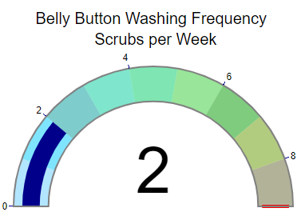
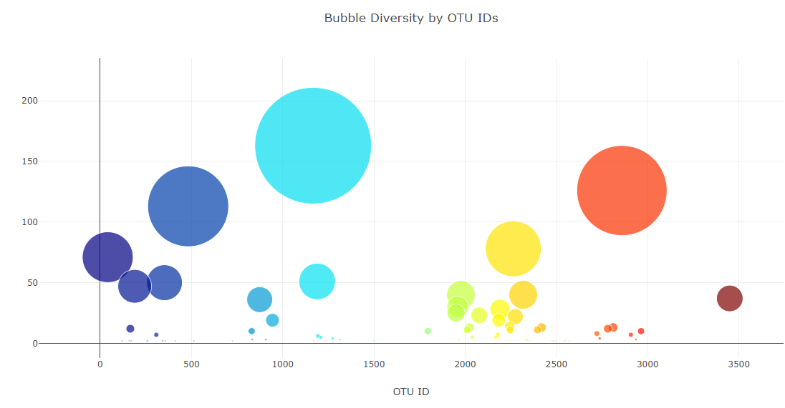
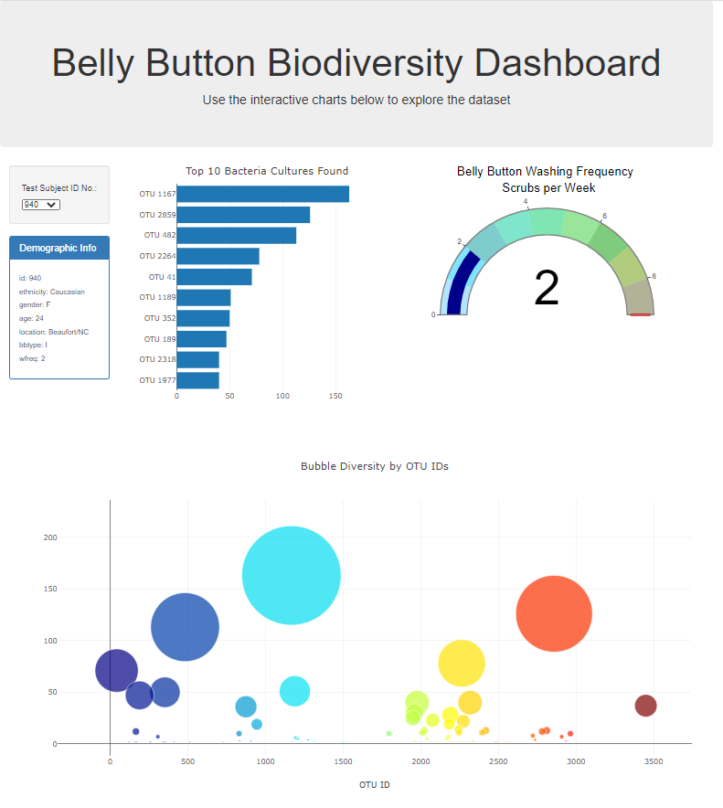

# Plot.ly Homework - Belly Button Biodiversity

This assignment included building an interactive dashboard using Plotly to explore Belly Button Biodiversity, which catalogs the microbes that colonize human navels.

The dataset reveals that a small handful of microbial species (also called operational taxonomic units, or OTUs, in the study) were present in more than 70% of people, while the rest were relatively rare.

## The dashboard included the following visuals and programs:

1. The use of a D3 library to read in `samples.json`.

2. The creation of a horizontal bar chart with a dropdown menu to display the top 10 OTUs found in that individual.

**Horizontal Bar Chart result:**

  

3. The creation of a gauge chart to plot the weekly washing frequency of the individual.

**Gauge Chart result:**

4. The creation of a bubble chart that displays each sample.

**Bubble Chart result:**

5. Creation of a display field to show individual's demographic information.

**Demographic information display result:**

6. All of the plots update any time a new sample is selected.

**Diagram of my final dashboard is shown below:**

